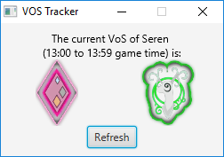

# VoSTracker

Track the Voice of Seren.

## Table of Contents
- [About the Project](#about)
    - [Built With](#built-with)
- [Getting Started](#getting-started)
    - [Prerequisites](#Prerequisites)
    - [Installation](#installation)
- [Usage](#usage)
- [Image Copyright](#image-copyright)

## About

Tracks the Voice of Seren and displays in a window. Created as a mini-project whilst learning Kotlin.

### Built With

- [Kotlin](https://kotlinlang.org/)
- [JavaFX](https://en.wikipedia.org/wiki/JavaFX)
- [khttp](https://khttp.readthedocs.io/en/latest/)

## Getting Started

To run the project follow these steps.

### Prerequisites

- [Java 8](https://www.oracle.com/technetwork/java/javase/downloads/jre8-downloads-2133155.html)

### Installation

Run using Gradle wrapper.

- Clone the repository.
- Build the project. `./gradlew build`
- Run the project. `./gradlew run`

# Usage

The application automatically updates on start and at every hour. Click refresh to do a manual update.

# Image Copyright

Images taken from runescape.com, and copyright held by Jagex Ltd. Used under fair use.
